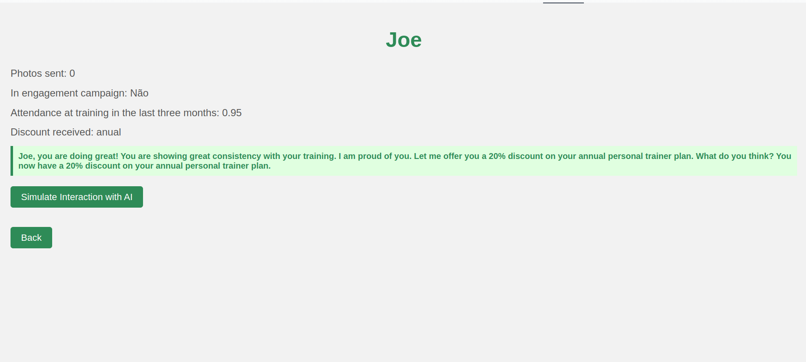

# Fitness App 🏋️‍♂️  

**Fitness App** is a next-generation platform designed to redefine the fitness experience through smart, AI-driven decision-making. Leveraging **Generative AI**, this app enhances user engagement and optimizes personal trainer sales by offering personalized rewards and promotions.

In traditional gym environments, user engagement often relies on manually analyzing limited data and applying static rules. These methods can be time-consuming, inflexible, and may overlook valuable opportunities to connect with users. The Fitness App addresses these challenges by analyzing a wide range of user data—such as gym attendance, workout routines, and progress tracking. This allows the app to identify user behavior patterns and implement tailored actions, such as motivating less engaged users with discounts on their first personal training session or rewarding loyal members with annual plan promotions.

---

## Application Layout  

 

## Features  

The Fitness App simulates a rich set of functionalities designed to enhance gym operations and improve user satisfaction. These features allow the AI to analyze user behavior and make informed decisions:

- **Seamless Check-In**: Users can easily check in at their gym, ensuring accurate attendance logging while promoting accountability. This data helps the AI understand attendance patterns and user engagement levels.

- **Progress Tracking**: The app tracks users' physical assessments over time, providing valuable insights into their fitness journey. By simulating progress tracking, the AI can identify trends and suggest personalized goals.

- **Progress Photos**: Fitness enthusiasts can upload photos to visualize their transformations, creating a motivating timeline of their progress. The AI analyzes these images to assess changes and encourage users based on their achievements.

- **Generative AI Engagement Analysis**: The app utilizes advanced AI to assess user engagement by simulating various interactions. It determines effective strategies for motivation, such as sending personalized promotions or encouraging new fitness goals tailored to individual user behaviors.

These simulated features collectively demonstrate how AI can make fitness management smarter, more dynamic, and tailored to individual needs.

---

## Getting Started  

Follow the steps below to set up and run the Fitness App locally.

### Installation  

1. **Clone the Repository**:  
   ```bash
   git clone git@github.com:kelsonbatista/fitness-app-with-ai-gemini.git

2. **Navigate to the Project Directory**:  
    ```bash
    cd fitness-app-with-ai-gemini

3. **Install Required Dependencies**:  
   ```bash
   pip install -r requirements.txt

4. **Start the Application**:  
   ```bash
   python app.py

4. **Open Your Browser**: 
   ```bash 
   Navigate to http://localhost:5000 to access the app.

## Build With
- **Python**: Core programming language used for backend and AI functionalities.
- **Flask**: Lightweight framework for building the web application.
- **Generative AI**: Advanced technology for engagement analysis and decision-making.
- **Hugging Face Spaces**: Hosting platform for seamless deployment.

## Live Demo
🔗 **Live Demo**: [Fitness App](https://kelsonbatista-fitness-app.hf.space)  
